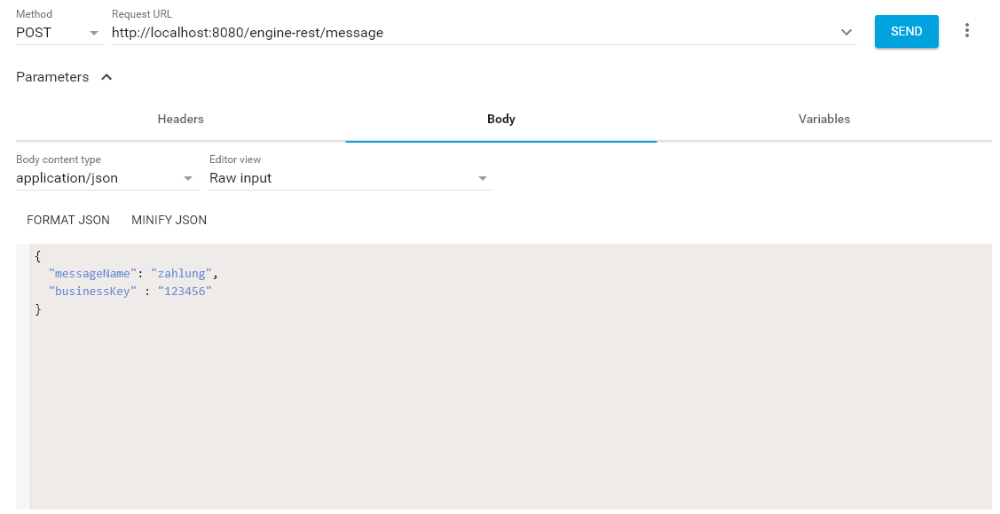

# imma-prozess
Beispielprozess zur elektronischen Immatrikulation mit Hilfe der BPMN-Process-Engine Camunda


## Lokale Installation / Konfiguration

Damit Sie den dargestellen "Prozess 1.0" auf ihrem System ausführen können, müssen Sie die folgenden Schritte umsetzen:

1. Laden Sie sich einen [Camunda Tomcat Server](https://camunda.com/download/) (7.6+) auf ihr System und entpacken Sie diesen. Zusätzlich benötigen sie eine aktuellen Version des [Java SE Development Kit's](http://www.oracle.com/technetwork/java/javase/downloads/index.html) (JDK).
	* Hinweis für Windows-Systeme: Damit der entpackte Tomcat Server starten kann, müssen Sie zwei [Umgebungsvariablen](http://techmixx.de/windows-10-umgebungsvariablen-bearbeiten/) zum installierten JDK definieren. Der Name der ersten Variable sollte "JAVA_HOME" und der Pfad sollte auf Ihren lokalen Speicherort verweisen, z.B. "C:\Programm Files\Java\jdk1.8.0_91".. Der Name der zweiten Variable sollte "JRE_Home" und der Pfad sollte auf Ihren lokalen Speicherort verweisen, z.B. "C:\Programm Files\Java\jre1.8.0_151".
2. Kopieren Sie aus dem Ordner "Mail Connector" die Datei "camunda-bpm-mail-core-1.3.0-SNAPSHOT.jar" in das untergeordnete lib-Verzeichnis des Tomcat (Verzeichnis: [Camunda Tomcat]\server\apache-tomcat-8.0.24\lib).
3. Danach kopieren Sie aus dem gleichen Ordner "Mail Connector" die Datei "mail-config.properties" in das untergeordnete conf-Verzeichnis des Tomcat (Verzeichnis: [Camunda Tomcat]\server\apache-tomcat-8.0.24\conf). Diese Datei ist für den Zugriff auf ein Mail-Konto notwendig. Öffnen Sie im Anschluss die Datei und richten den Zugriff auf ein E-Mail Konto ein.
	* Hinweis: Sollten Sie ihr privates E-Mail Konto benutzen, achten Sie darauf, die Datei nicht mit Dritten zu teilen.
	* Hinweis für Windows-Systeme: Damit der Tomcat die .properties Datei finden kann, müssen Sie die [Umgebungsvariable](http://techmixx.de/windows-10-umgebungsvariablen-bearbeiten/) für die Datei definieren. Der Name der Variable sollte "MAIL_CONFIG" lauten und der Pfad sollte lauten "[Camunda Tomcat]\server\apache-tomcat-8.0.24\conf\mail-config.properties".
	* Siehe auch: [E-Mail Connector](https://github.com/camunda/camunda-bpm-mail) und [E-Mail Connector Beispiel](https://github.com/camunda/camunda-bpm-mail/tree/master/examples/pizza).
4. Anschließend installieren Sie einen lokalen Webserver welcher cURL unterstützt (z.B. [XAMPP](https://www.apachefriends.org/de/download.html) ). Nachdem sie diesen installiert haben, kopieren Sie aus dem Ordner "Externe Webseiten Formulare" alle .php Formulare in den "htdocs" Ordner ihres Webservers.
	* Hinweis: Achten Sie darauf, über welche URL der Webserver angesprochen wird. Sollt diese nicht "http://127.0.0.1/" lauten, muss die URL des Webservers oder die E-Mail-Beschreibung der Sende-Aufgaben und -Ereignisse im Prozess angepasst werden.
5. Kopieren aus dem Ordner "Prozess (.war)" die Datei "imma-0.1.0-SNAPSHOT.war" in das untergeordnete Verzeichnis "webapps" (Verzeichnis: [Camudna Tomcat]\server\apache-tomcat-8.0.24\webapps).

## Prozess bearbeiten

Text in Arbeit

## Konfiguration des Prozesses

Text in Arbeit

1. E-Mail
2. Ereignisse
3. etc.

## Rest-API ansteuern

Um die Benutzer-Aufgaben oder Nachrichten-Ereignisse von außerhalb auslösen zu können, müssen Sie auf die [REST API](https://docs.camunda.org/manual/latest/reference/rest/) von Camunda zugreifen. Die REST API wird im „Prozess 1.0“ über die „externen Webseiten Formulare“ via cURL (PHP) angesteuert. 
```php
$csendfile = curl_init('http://localhost:8080/engine-rest/task/'.$taskid.'/submit-form');                                                                      
curl_setopt($csendfile, CURLOPT_CUSTOMREQUEST, "POST");                                                                     
curl_setopt($csendfile, CURLOPT_POSTFIELDS, $data);                                                                  
curl_setopt($csendfile, CURLOPT_RETURNTRANSFER, true);                                                                      
curl_setopt($csendfile, CURLOPT_HTTPHEADER, array(                                                                          
    'Content-Type: application/json')                                                                       
);  
```
Im Prozess werden jedoch nicht alle Nachriten-Ereignisse über die Webseiten-Formulare angesteuert. Um diese auszulösen, können REST-Client’s eingesetzt werden (z.B. [Advanced REST Client](https://install.advancedrestclient.com/#/install) ). Diese dienen zur Simulation und Testung eines REST-Aufrufs.



Wichtig hierbei ist, dass die „Request URL“ und der „Body“ des JSON-Strings richtig geschrieben sind. Die URL sollte für lokale Anwendungen immer folgendermaßen beginnen „http://localhost:8080/engine-rest/“ alle nachfolgenden Informationen sind REST-Aufruf spezifisch. Die Einstellungen für den Body müssen Sie der [Camunda Dokumentation](https://docs.camunda.org/manual/latest/reference/rest/) entnehmen (Beispiel für ein [empfangendes Nachrichten-Ereignis](https://docs.camunda.org/manual/latest/reference/rest/message/post-message/) ).
	* Hinweis: Die Request URL für ein [empfangendes Nachrichten-Ereignis](https://docs.camunda.org/manual/7.8/reference/rest/message/post-message/) setzt sich folgender Maßen zusammen: "http://localhost:8080/engine-rest/" + "message"
	* Hinweis: Die Request URL zum beenden einer [Benutzer-Aufgabe](https://docs.camunda.org/manual/7.8/reference/rest/task/post-submit-form/) lautet: "http://localhost:8080/engine-rest/" + "task/{id}/submit-form"
	


