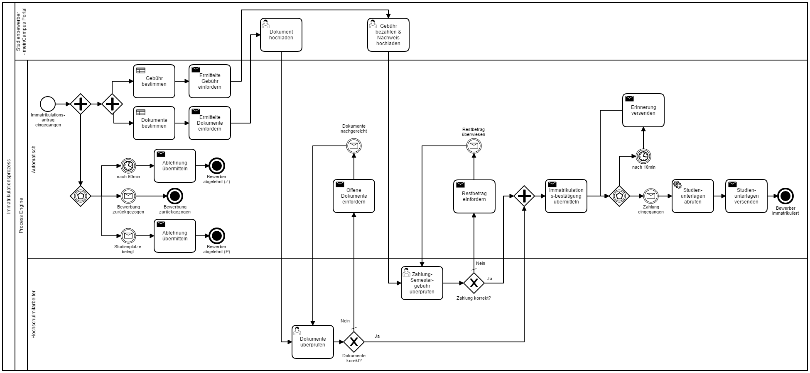

# imma-prozess
Beispielprozess zur elektronischen Immatrikulation mit Hilfe der BPMN-Process-Engine Camunda

## Lokale Installation / Konfiguration

Damit sie den "Prozess 1.0" auf ihrem System ausführen können, müssen Sie die folgenden Schritte umsetzen:

1. Laden Sie sich einen [Camunda Tomcat Server](https://camunda.com/download/) (7.6+) auf ihr System und entpacken Sie diesen.
2. Kopieren Sie aus dem Ordner "Mail Connector" die Datei "camunda-bpm-mail-core-1.3.0-SNAPSHOT.jar" in das untergeordnete lib-Verzeichnis des Tomcat ([Camunda Tomcat]\server\apache-tomcat-8.0.24\lib).
3. Danach kopieren Sie aus dem gleichen Ordner "Mail Connector" die Datei "mail-config.properties" in das untergeordnete conf-Verzeichnis des Tomcat ([Camunda Tomcat]\server\apache-tomcat-8.0.24\conf). Diese Datei ist für den Zugriff auf ein Mail-Konto notwendig.
	* Hinweis: Sollten Sie ihr privates E-Mail Konto benutzen, achten Sie darauf, die Datei nicht mit Dritten zu teilen.
	* Hinweis für Windows-Systeme: Damit der Tomcat die .properties Datei finden kann, müssen Sie die [Umgebungsvariable](http://techmixx.de/windows-10-umgebungsvariablen-bearbeiten/) für die Datei definieren. Der Name der Variable sollte "MAIL_CONFIG" lauten und der Pfad sollte lauten "[Tomcat Server]\server\apache-tomcat-8.0.24\conf\mail-config.properties".
	* Siehe auch: [E-Mail Connector](https://github.com/camunda/camunda-bpm-mail) und [E-Mail Connector Beispiel](https://github.com/camunda/camunda-bpm-mail/tree/master/examples/pizza).
4. Anschließend installieren Sie einen lokalen Webserver welcher cURL unterstützt (z.B. [XAMPP](https://www.apachefriends.org/de/download.html) ). Nachdem sie diesen installiert haben, kopieren Sie aus dem Ordner "Externe Webseiten Formulare" alle .php Formulare in den "htdocs" Ordner ihres Webservers.
	* Hinweis: Achten Sie darauf, über welche URL der Webserver angesprochen wird. Sollt diese nicht "http://127.0.0.1/" lauten, der Webserver oder Sende-Aufgaben und Sende-Ereignisse (im Prozess) angepasst werden.
5. Kopieren aus dem Ordner "Prozess (.war)" die Datei "imma-0.1.0-SNAPSHOT.war" in das untergeordnete Verzeichnis "webapps" ([Tomcat Server]\server\apache-tomcat-8.0.24\webapps).

## Prozess bearbeiten

Text in Arbeit

